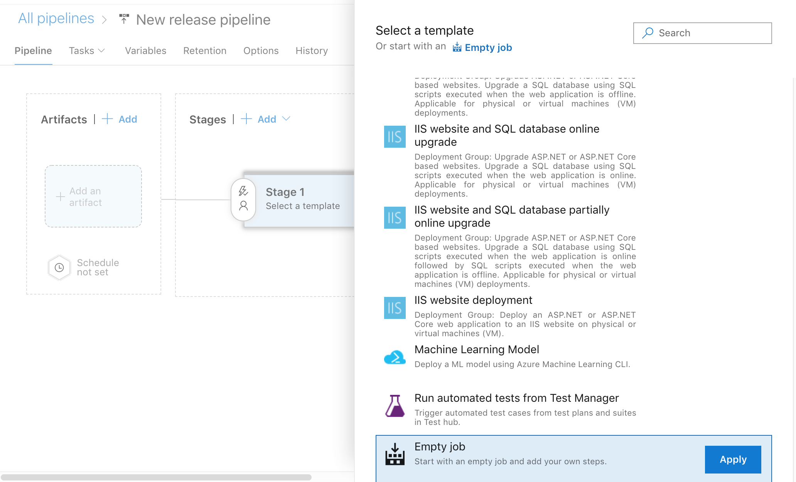
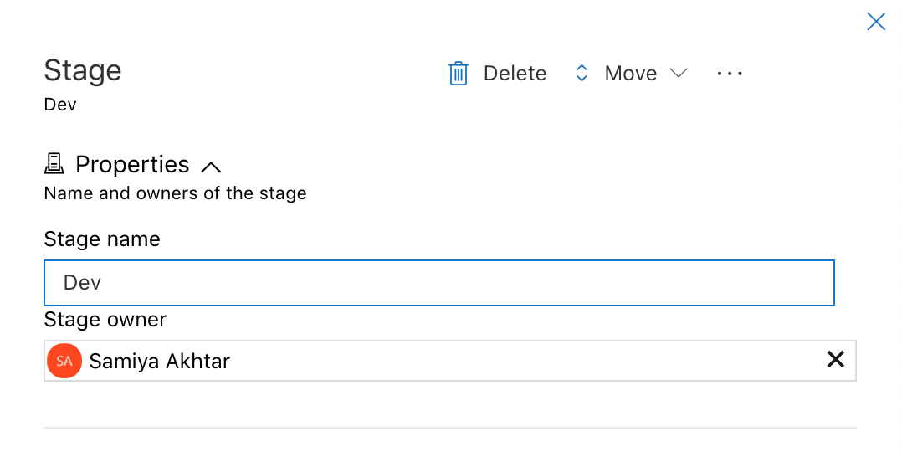
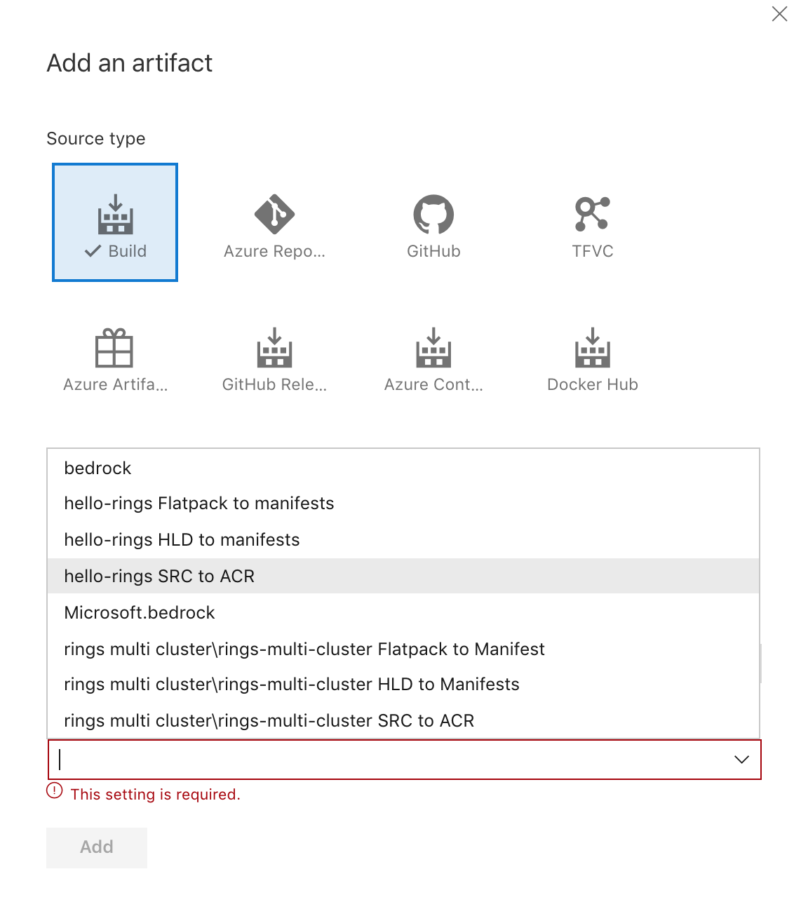
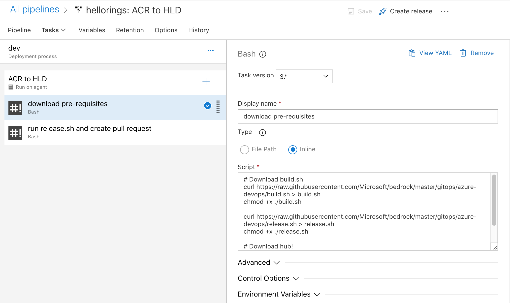
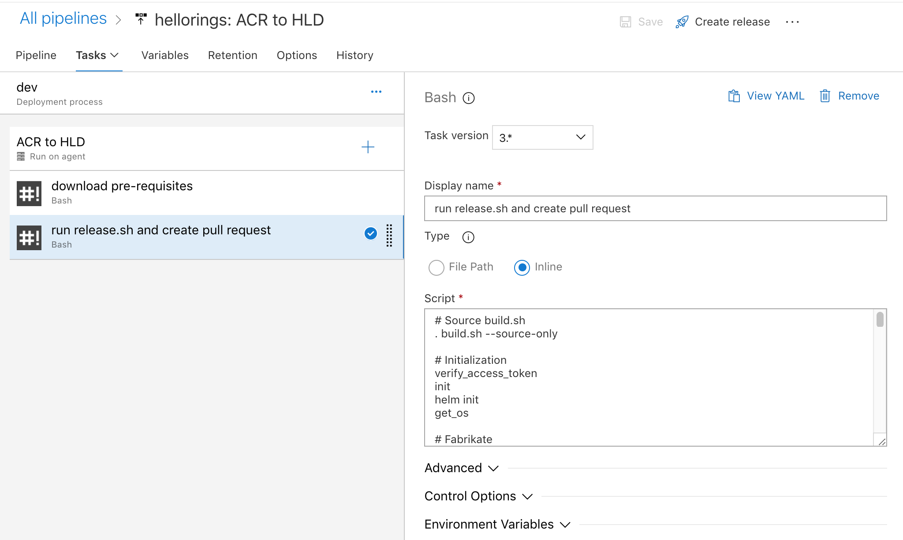
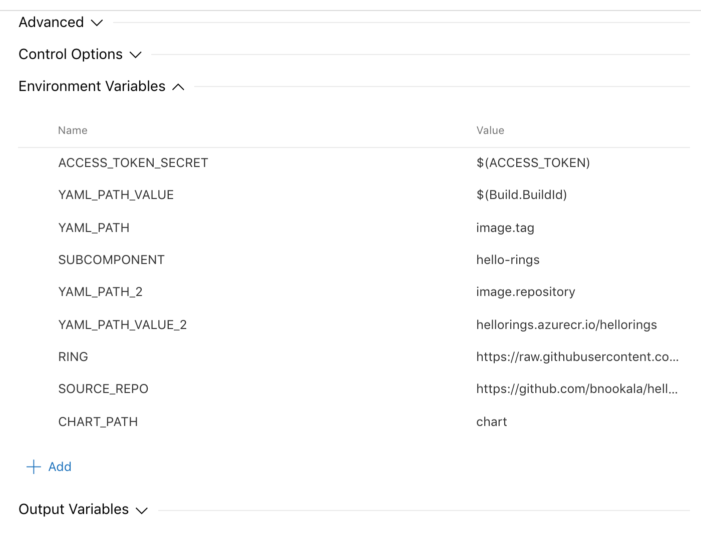

## SRC to ACR

The first pipeline in the process is to build the source repository, run any required tests, and push the built image to the container registry. You may refer to our [sample hello world rings](https://github.com/bnookala/hello-rings) repository located here. 

Create a new `azure-pipelines.yml` file in the source repository and add the following code to it:
```
trigger:
branches:
    include:
    - master
    - '*'
paths:
    include:
    - '*'

pool:
vmImage: 'ubuntu-latest'

steps:
- task: Docker@2
inputs:
    containerRegistry: '<name_of_the_container_registry>'
    repository: '<name_of_the_repository>'
    command: 'buildAndPush'
    Dockerfile: '**/src/Dockerfile' # Path to the Dockerfile
    tags: 'hello-rings-$(Build.SourceBranchName)-$(Build.BuildId)' # Use this format to have the tag name audit information forward for the next pipelines

```

*Note*: The format used for tags is used a certain way to allow the next few pipelines to extract information from it for branch name and build ID. If you change this format, you may have to update the subsequent pipelines in a different way.

If you have any additional test steps in your project, add them to this file before the Docker step. Run the pipeline and you should be able to see a new tag cre

## ACR to HLD

This Azure pipeline is meant to be a Release pipeline which is triggered by the ACR image published in the previous step as an artifact. It accomplishes the following objectives:

- Download and Install the pre-requisites [Fabrikate](https://github.com/Microsoft/fabrikate) and [Hub](https://hub.github.com/)
- Clone the HLD repo
- Execute `fab set` to manipulate HLDs to update the new image tag build in the previous pipeline
- Execute `fab add` to add any ring that is newly created (as a branch)
- Git commit and push to service HLD repo in a new branch
- Open a pull request from this new branch into the service HLD using Hub

To start off, you can create the first environment (e.g. Dev) using an Empty Job template. 



Add a new stage to the pipeline, for eg. Dev



Add a new artifact by selecting the build pipeline we created in the previous step. You could also add the ACR directly as an artifact. 



Add two build steps to this pipeline, one downloads the necessary pre-requisites and the second runs the release pipeline. 

For the first build step, copy the following lines of code:

```
# Download build.sh
curl https://raw.githubusercontent.com/Microsoft/bedrock/master/gitops/azure-devops/build.sh > build.sh
chmod +x ./build.sh

curl https://raw.githubusercontent.com/Microsoft/bedrock/master/gitops/azure-devops/release.sh > release.sh
chmod +x ./release.sh

# Download hub!
sudo add-apt-repository ppa:cpick/hub
sudo apt-get update
sudo apt-get install hub
```



For the second step, copy the following lines of code:

```
# Source build.sh
. build.sh --source-only

# Initialization
verify_access_token
init
helm init
get_os

# Fabrikate
get_fab_version
download_fab

# Clone HLD repo
git_connect

subcomponent=$(echo "$YAML_PATH_VALUE" | sed 's/\-[^-]*$//')

echo "FAB SET"
if [[ ! -z $FAB_ENV_NAME ]]
then
    fab set --environment $FAB_ENV_NAME --subcomponent $subcomponent $YAML_PATH=$YAML_PATH_VALUE $YAML_PATH_2=$YAML_PATH_VALUE_2
else
    fab set --subcomponent $subcomponent $YAML_PATH=$YAML_PATH_VALUE $YAML_PATH_2=$YAML_PATH_VALUE_2
fi

echo "GIT STATUS"
git status

# extract branch name from the full subcomponent
branch_name=$(echo ${subcomponent##*-})
# Execute fab add to add this branch to the service HLD
fab add $subcomponent --source $SOURCE_PATH --branch $branch_name --method git --path $CHART_PATH --type helm


echo "GIT ADD"
git add -A

pr_branch_name=pr_$subcomponent_$YAML_PATH_VALUE
git checkout -b $pr_branch_name

# Set git identity
git config user.email "admin@azuredevops.com"
git config user.name "Automated Account"

echo "GIT COMMIT"
git commit -m "Updating image tag for service $branch_name"

echo "GIT PUSH"
git_push origin $pr_branch_name

# Create pull request
export GITHUB_TOKEN=$ACCESS_TOKEN_SECRET
hub version
hub pull-request -m "Updating service $branch_name"
```



Add the following environment variables to this build step:

- ACCESS_TOKEN_SECRET: Set this to the personal access token from GitHub/Azure DevOps 
- YAML_PATH_VALUE: Set this to `$(Build.BuildId)` so that it can be used to update the image tag built in the previous pipeline
- YAML_PATH: Set this to the field which needs to be updated in the HLD, in this case `image.tag`
- SUBCOMPONENT: Set this to the name of the subcomponent that you're trying to update in the HLD
- YAML_PATH_2: Set this to the second field updating in this step, in this case, the image repository `image.repository`
- YAML_PATH_VALUE_2: Set this to the value for the image repository, such as `hellorings.azurecr.io/hellorings`
- SOURCE_REPO: Set this to the URL for the source code repository, in this case `https://github.com/bnookala/hello-rings`
- CHART_PATH: Set this to the folder in the source repository where the charts are located, in this example they're in `chart`



Run these steps from the very beginning, from the SRC to ACR pipeline, and shortly you should see a new release kicked off for the newly built ACR image. Check the pull requests page to see if a new PR is opened against the service HLD!

When you push a new branch, a pull request should be open for that ring against the service HLD. Make sure that the SRC to ACR pipeline is triggered for all branches (not just master) to allow new rings to be pull requested. 


